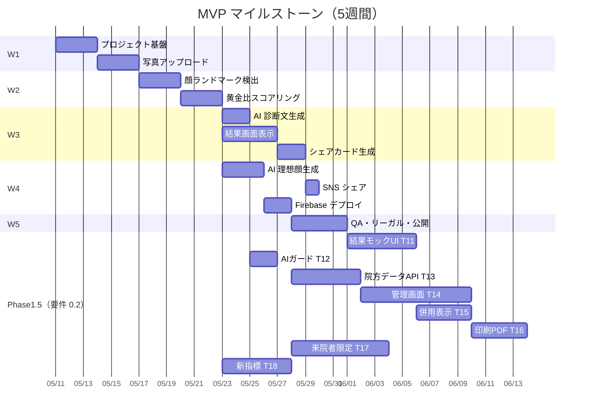

# チケット一覧（INDEX）

TIAM Beauty AI 診断 MVP のチケット（タスク）一覧です。各ファイルに TODO チェックリストを持ち、進捗管理もこのフォルダで完結させます。

> 📘 **第三者向け開発ドキュメント** は [README.md](./README.md) から `api/` / `architecture/` / `features/` / `guides/` を参照してください。INDEX はあくまで MVP 開発時のチケット履歴です。

- 親要件: [requirements.md](./requirements.md)
- プロジェクト本体: リポジトリルート（`package.json` がある階層。Next.js アプリとこの `docs/` が並ぶ）

## ステータス凡例

- `未着手` / `進行中` / `レビュー中` / `完了` / `保留`

## チケット一覧

| #   | チケット                                                                | 関連要件 | 優先度 | ステータス | 依存       |
| --- | ----------------------------------------------------------------------- | -------- | ------ | ---------- | ---------- |
| 00  | [プロジェクト基盤セットアップ](./00-project-setup.md)                   | -        | 高     | 完了       | -          |
| 01  | [写真アップロード機能](./01-photo-upload.md)                            | F-01     | 高     | 完了       | 00         |
| 02  | [顔ランドマーク検出（MediaPipe）](./02-face-landmark-detection.md)      | F-02     | 高     | 完了       | 01         |
| 03  | [黄金比スコアリング（TIAM 指標）](./03-golden-ratio-scoring.md)     | F-03     | 高     | 完了       | 02         |
| 04  | [AI 診断文生成 API](./04-ai-diagnosis-text.md)                          | F-04     | 高     | 完了       | 03         |
| 05  | [結果画面表示](./05-result-screen.md)                                   | F-05     | 高     | 完了       | 03, 04     |
| 06  | [シェアカード生成（Satori）](./06-share-card.md)                        | F-06     | 高     | 完了       | 05         |
| 07  | [AI 理想顔生成（gpt-image-1）](./07-ai-ideal-portrait.md)               | F-07     | 中     | 完了       | 03         |
| 08  | [SNS シェア](./08-sns-share.md)                                         | F-08     | 中     | 完了       | 06         |
| 09  | [Firebase デプロイ](./09-deploy.md)                                     | -        | 高     | 完了       | 01–08      |
| 10  | [QA・リーガル・ベータ公開](./10-qa-release.md)                          | -        | 高     | 進行中     | 09         |
| 11  | [結果画面モック準拠 UI](./11-result-mock-ui.md)                         | §4.9 F-05 | 高     | 完了       | 05         |
| 12  | [AI 診断ガードレール（施術名禁止）](./12-ai-diagnosis-guardrails.md)     | §4.9.1 F-04 | 高   | 完了       | 04         |
| 13  | [ドクター記述データモデル＆API](./13-doctor-content-model-api.md)       | §4.9.2   | 高     | 完了       | 09         |
| 14  | [ドクター向け管理画面](./14-doctor-admin-cms.md)                        | §4.9.2   | 中     | 完了       | 13         |
| 15  | [院方コンテンツ併用表示](./15-result-doctor-merged-display.md)          | §4.9.1–4 | 高     | 未着手     | 11, 13     |
| 16  | [診断レポート印刷／PDF](./16-report-print-pdf.md)                       | §4.9.3   | 中     | 未着手     | 15         |
| 17  | [来院者限定アクセス](./17-clinic-access-restrictions.md)              | §1.5     | 中     | 未着手     | 09         |
| 18  | [目の位置・左右対称の独立指標](./18-eye-position-symmetry-metrics.md) | F-03, F-05 | 中〜高 | 完了     | 02, 03     |

## 進捗サマリ

- 完了: 14 / 19（T-00〜T-09, T-11, T-12, T-13, T-18）
- 進行中: 1 / 19（T-10）

## 依存関係（ガント概要）

※ Phase 1.5 のガントは目安。T-12 は T-04 完了後いつでも着手可。T-18 はランドマーク・既存スコアリング（T-02, T-03）完了後に着手。

## 運用ルール

- チケット着手時: ヘッダの `ステータス` を `進行中` に更新し、`担当` を記入
- 完了時: TODO を全てチェック → `ステータス` を `完了` に更新 → INDEX のステータスも更新
- ブロッカー発生時: `ステータス` を `保留` にし、メモ欄に理由を記載
