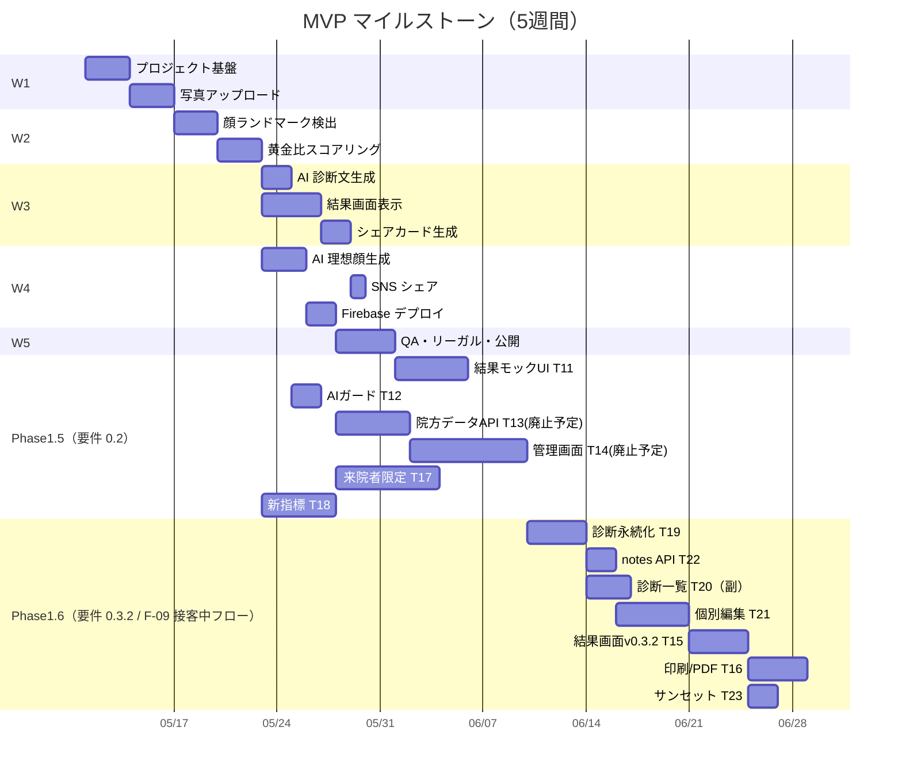

# チケット一覧（INDEX）

TIAM Beauty AI 診断 MVP のチケット（タスク）一覧です。各ファイルに TODO チェックリストを持ち、進捗管理もこのフォルダで完結させます。

> 📘 **第三者向け開発ドキュメント** は [README.md](./README.md) から `api/` / `architecture/` / `features/` / `guides/` を参照してください。INDEX はあくまで MVP 開発時のチケット履歴です。

- 親要件: [requirements.md](./requirements.md)
- プロジェクト本体: リポジトリルート（`package.json` がある階層。Next.js アプリとこの `docs/` が並ぶ）

## ステータス凡例

- `未着手` / `進行中` / `レビュー中` / `完了` / `保留`

## チケット一覧

| #   | チケット                                                                | 関連要件 | 優先度 | ステータス | 依存       |
| --- | ----------------------------------------------------------------------- | -------- | ------ | ---------- | ---------- |
| 00  | [プロジェクト基盤セットアップ](./00-project-setup.md)                   | -        | 高     | 完了       | -          |
| 01  | [写真アップロード機能](./01-photo-upload.md)                            | F-01     | 高     | 完了       | 00         |
| 02  | [顔ランドマーク検出（MediaPipe）](./02-face-landmark-detection.md)      | F-02     | 高     | 完了       | 01         |
| 03  | [黄金比スコアリング（TIAM 指標）](./03-golden-ratio-scoring.md)     | F-03     | 高     | 完了       | 02         |
| 04  | [AI 診断文生成 API](./04-ai-diagnosis-text.md)                          | F-04     | 高     | 完了       | 03         |
| 05  | [結果画面表示](./05-result-screen.md)                                   | F-05     | 高     | 完了       | 03, 04     |
| 06  | [シェアカード生成（Satori）](./06-share-card.md)                        | F-06     | 高     | 完了       | 05         |
| 07  | [AI 理想顔生成（gpt-image-1）](./07-ai-ideal-portrait.md)               | F-07     | 中     | 完了       | 03         |
| 08  | [SNS シェア](./08-sns-share.md)                                         | F-08     | 中     | 完了       | 06         |
| 09  | [Firebase デプロイ](./09-deploy.md)                                     | -        | 高     | 完了       | 01–08      |
| 10  | [QA・リーガル・ベータ公開](./10-qa-release.md)                          | -        | 高     | 進行中     | 09         |
| 11  | [結果画面モック準拠 UI](./11-result-mock-ui.md)                         | §4.9 F-05 | 高     | 完了       | 05         |
| 12  | [AI 診断ガードレール（施術名禁止）](./12-ai-diagnosis-guardrails.md)     | §4.9.1 F-04 | 高   | 完了       | 04         |
| 13  | [ドクター共通テンプレ（廃止予定）](./13-doctor-content-model-api.md)    | §4.9.2   | 高     | 廃止予定   | 09         |
| 14  | [ドクター共通テンプレ管理画面（廃止予定）](./14-doctor-admin-cms.md)    | §4.9.2   | 中     | 廃止予定   | 13         |
| 15  | [結果画面 v0.3.2（個別ノート併用表示 + ドクター追記 CTA）](./15-result-doctor-merged-display.md) | §4.9.3 §4.9.6 §5.2.1 | 高 | 完了 | 11, 19, 21, 22 |
| 16  | [診断レポート印刷／PDF](./16-report-print-pdf.md)                       | §4.9.3   | 中     | 未着手     | 15         |
| 17  | [来院者限定アクセス](./17-clinic-access-restrictions.md)              | §1.5     | 中     | 未着手     | 09         |
| 18  | [目の位置・左右対称の独立指標](./18-eye-position-symmetry-metrics.md) | F-03, F-05 | 中〜高 | 完了     | 02, 03     |
| 19  | [診断結果の永続化（diagnoses コレクション）](./19-diagnoses-persistence.md) | F-09 §4.9.5 §5.2.1 | 高 | 完了 | 04, 09     |
| 20  | [管理画面: 診断一覧（/admin/diagnoses）](./20-admin-diagnoses-list.md) | F-09 §4.9.6（副フロー） | 中 | 未着手 | 19         |
| 21  | [管理画面: 診断個別ノート編集](./21-admin-diagnoses-edit.md)           | F-09 §4.9.5 §4.9.6 §5.2.1 | 高 | 完了 | 19, 22     |
| 22  | [doctor_notes API（GET / PUT）](./22-doctor-notes-api.md)              | F-09 §4.10 §5.2.1 | 高 | 完了 | 19         |
| 23  | [共通テンプレ層のサンセット（T-13/T-14 廃止）](./23-deprecate-doctor-content.md) | §4.9.2 注記 | 中 | 未着手 | 15, 21     |

## 推奨実行順（要件 v0.3.2 反映）

接客中フロー（**結果画面 → ドクター追記 CTA → 編集画面 → 反映**）を最短で成立させる順序。

```
T-19 ──┬──> T-22 ──┐
       │           ├──> T-21 ──> T-15 ──> T-23
       └──> T-20 ──┘                       │
                                           └──> T-16（印刷/PDF）
```

| 順 | チケット | 役割 |
|----|----------|------|
| 1 | **T-19** | `diagnoses/{resultId}` 永続化と `verifyAdminFromRequest` の `staff` クレーム対応。F-09 全体の土台 |
| 2 | **T-22**（推奨先行） | `doctor_notes` API。T-21 の保存先を先に固める |
| 2' | **T-20**（並列可） | 一覧画面。後日記入の保険動線。接客中 UX には必須でないため後回し可 |
| 3 | **T-21** | `/admin/diagnoses/{resultId}` 編集画面。AI 参照 + パーツ別ノート + 反映 |
| 4 | **T-15（再定義）** | 結果画面 v0.3.2: 個別ノート併用表示 + ドクター追記 CTA + 静的免責文言 |
| 5 | **T-23** | T-13/T-14 共通テンプレ層のサンセット |
| 6 | T-16 / T-17 | 印刷・PDF（T-15 後）／来院者限定アクセス（独立可） |

> **位置づけ**: T-21 を T-15 より先に完了させると、結果画面 CTA から遷移した直後の編集画面が機能している状態でリリースできる。T-20 は並列着手しても良いが、レビュー優先度は接客中フロー（19→22→21→15）より一段下げる。

## 進捗サマリ

- 完了: 17 / 24（T-00〜T-09, T-11, T-12, T-15, T-18, T-19, T-21, T-22）
- 進行中: 1 / 24（T-10）
- 廃止予定: 2 / 24（T-13, T-14。コード資産は T-15 / T-19〜T-22 で流用）
- 仕様変更: 0 / 24（T-15 は v0.3.2 仕様で完了）
- F-09 関連新規: 5 / 24（T-19〜T-23）
- v0.3.2 接客中フロー成立: コアフロー完了（残: T-20 一覧・T-23 旧 API 撤去など）

## 依存関係（ガント概要）



※ Phase 1.5 のガントは目安。T-12 は T-04 完了後いつでも着手可。T-18 はランドマーク・既存スコアリング（T-02, T-03）完了後に着手。Phase 1.6（F-09 / v0.3.2）は **T-19 → T-22 → T-21 → T-15 → T-23** が主動線。T-20（一覧）は副フロー位置づけのため T-22 と並列可。T-15 は v0.3.2 で「個別ノート併用表示 + ドクター追記 CTA」として再定義済み。

## 運用ルール

- チケット着手時: ヘッダの `ステータス` を `進行中` に更新し、`担当` を記入
- 完了時: TODO を全てチェック → `ステータス` を `完了` に更新 → INDEX のステータスも更新
- ブロッカー発生時: `ステータス` を `保留` にし、メモ欄に理由を記載
