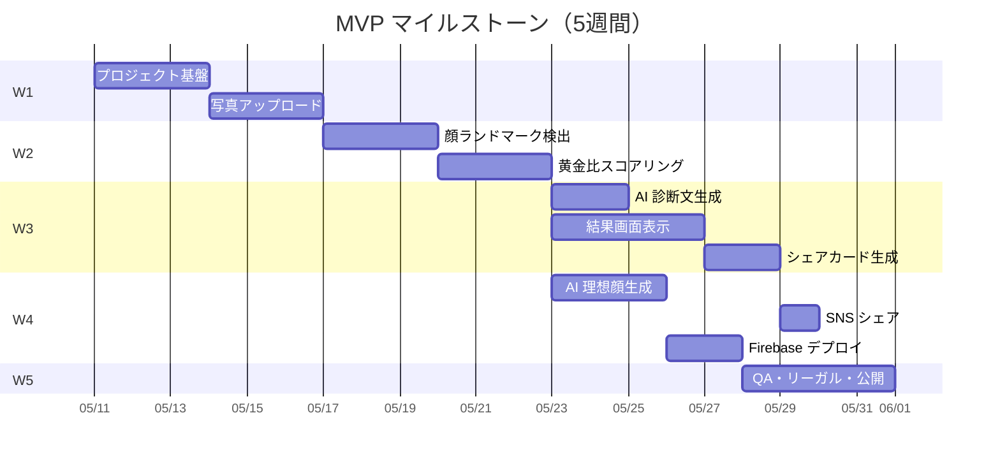

# チケット一覧（INDEX）

TIAM Beauty AI 診断 MVP のチケット（タスク）一覧です。各ファイルに TODO チェックリストを持ち、進捗管理もこのフォルダで完結させます。

> 📘 **第三者向け開発ドキュメント** は [README.md](./README.md) から `api/` / `architecture/` / `features/` / `guides/` を参照してください。INDEX はあくまで MVP 開発時のチケット履歴です。

- 親要件: [requirements.md](./requirements.md)
- プロジェクト本体: リポジトリルート（`package.json` がある階層。Next.js アプリとこの `docs/` が並ぶ）

## ステータス凡例

- `未着手` / `進行中` / `レビュー中` / `完了` / `保留`

## チケット一覧

| #   | チケット                                                                | 関連要件 | 優先度 | ステータス | 依存       |
| --- | ----------------------------------------------------------------------- | -------- | ------ | ---------- | ---------- |
| 00  | [プロジェクト基盤セットアップ](./00-project-setup.md)                   | -        | 高     | 完了       | -          |
| 01  | [写真アップロード機能](./01-photo-upload.md)                            | F-01     | 高     | 完了       | 00         |
| 02  | [顔ランドマーク検出（MediaPipe）](./02-face-landmark-detection.md)      | F-02     | 高     | 完了       | 01         |
| 03  | [黄金比スコアリング（TIAM 6 大指標）](./03-golden-ratio-scoring.md)     | F-03     | 高     | 完了       | 02         |
| 04  | [AI 診断文生成 API](./04-ai-diagnosis-text.md)                          | F-04     | 高     | 完了       | 03         |
| 05  | [結果画面表示](./05-result-screen.md)                                   | F-05     | 高     | 完了       | 03, 04     |
| 06  | [シェアカード生成（Satori）](./06-share-card.md)                        | F-06     | 高     | 完了       | 05         |
| 07  | [AI 理想顔生成（gpt-image-1）](./07-ai-ideal-portrait.md)               | F-07     | 中     | 完了       | 03         |
| 08  | [SNS シェア](./08-sns-share.md)                                         | F-08     | 中     | 完了       | 06         |
| 09  | [Firebase デプロイ](./09-deploy.md)                                     | -        | 高     | 完了       | 01–08      |
| 10  | [QA・リーガル・ベータ公開](./10-qa-release.md)                          | -        | 高     | 未着手     | 09         |

## 進捗サマリ

- 完了: 10 / 11
- 進行中: 0 / 11

## 依存関係（ガント概要）

## 運用ルール

- チケット着手時: ヘッダの `ステータス` を `進行中` に更新し、`担当` を記入
- 完了時: TODO を全てチェック → `ステータス` を `完了` に更新 → INDEX のステータスも更新
- ブロッカー発生時: `ステータス` を `保留` にし、メモ欄に理由を記載
