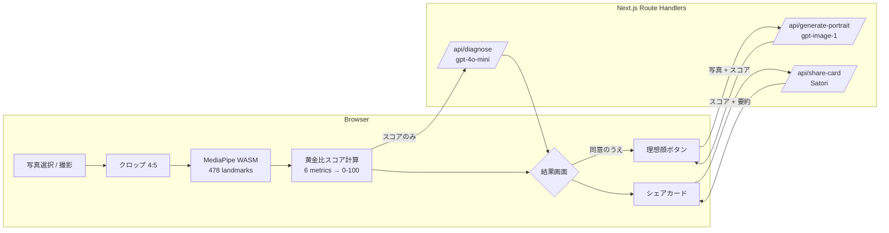

# システム全体像

## プロダクトの一行説明

TIAM Beauty AI 診断は、**ブラウザで撮影／選択した顔写真を MediaPipe で 478 点に分解し、「黄金比からの乖離」を 6 指標で 0–100 にスコア化した上で、AI が美容バランスの傾向を解説する** Web アプリです。医療診断ではなく、サロン的な美容アドバイスのデモンストレーションを目的としています。

## 画面構成

| ルート | 用途 | ファイル |
| --- | --- | --- |
| `/` | ランディング + 同意フロー + 写真アップロード | `app/page.tsx` |
| `/diagnose` | 顔検出 → スコア計算 → AI 診断文生成 | `app/diagnose/page.tsx` |
| `/result/[id]` | 結果表示・理想顔・シェアカード | `app/result/[id]/page.tsx` |
| `/(legal)/privacy` | プライバシーポリシー | `app/(legal)/privacy/page.tsx` |
| `/(legal)/terms` | 利用規約 | `app/(legal)/terms/page.tsx` |

## サーバー側エンドポイント

| ルート | 用途 |
| --- | --- |
| `POST /api/diagnose` | スコア → AI 診断文（gpt-4o-mini） |
| `POST /api/generate-portrait` | 写真 + スコア → 理想顔 PNG（gpt-image-1） |
| `POST /api/share-card` | スコア + 要約 → SNS 用 PNG（Satori） |
| `GET /api/health` | App Hosting readiness probe |

詳細は [api/README.md](../api/README.md)。

## 高レベルなデータの流れ

詳細は [data-flow.md](./data-flow.md)。

## 状態の保持先

- **クライアント状態**: Zustand ストア（[`lib/store/diagnosis-store.ts`](../../lib/store/diagnosis-store.ts)）
- **同意状態**: `sessionStorage`（[`lib/consent.ts`](../../lib/consent.ts)）
- **サーバー状態**: なし（MVP はステートレス）。レート制限カウンタのみプロセスメモリ
- **永続化**: なし。リロードすると診断結果は失われる（ストア → URL `id` 復元の仕組みはあるが、`id` は nanoid で結びつくのみ）

## 実行環境

- **開発**: `npm run dev` でローカル `http://localhost:3000`
- **本番**: Firebase App Hosting（GitHub 連動デプロイ）→ Cloud Run コンテナ
- **設定**: `apphosting.yaml`（リソース / 環境変数 / Secret Manager）
- **API キー**: Cloud Secret Manager に保管（[guides/deployment](../guides/deployment.md)）

## なぜこの構成なのか

| 判断 | 理由 |
| --- | --- |
| MediaPipe をクライアント WASM | サーバーへの写真送信を最小化（プライバシー / 帯域 / レイテンシ） |
| OpenAI 呼び出しはサーバー Route Handler | API キーをクライアントバンドルに出さない |
| 画像生成だけ写真を送る | 体験上のキラー機能。同意 + レート制限で守る |
| Firebase App Hosting | Next.js 16 公式サポート / SSR + Route Handler 動作 / GitHub push でデプロイ |
| 永続化なし（MVP） | 結果保存・履歴は要件外。Phase 2 で導入する想定 |
