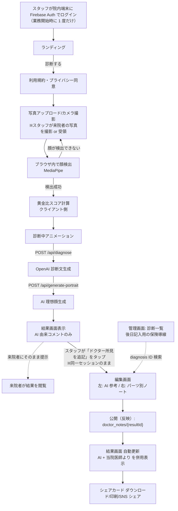

# TIAM Beauty AI 診断 Web アプリ 要件定義書

| 項目         | 内容                                |
| ------------ | ----------------------------------- |
| プロダクト名 | TIAM Beauty AI 診断（仮）           |
| バージョン   | 0.3.2（院内限定ツール化・スタッフ事前ログイン運用） |
| 作成日       | 2026-05-10                          |
| 最終更新     | 2026-05-16                          |
| 作成者       | TIAM 開発チーム                     |
| ステータス   | ドラフト                            |

---

## 1. プロジェクト概要

### 1.1 目的

ユーザーがアップロードした顔写真を AI が解析し、黄金比に基づく独自スコアと、美容アドバイスを含む診断レポートを自動生成する Web アプリを開発する。

「GPT が答えている」ように見せず、**TIAM 独自の AI 診断ブランド**として体験できる UI / UX を提供することを最重要要件とする。

### 1.2 ターゲットユーザー

- 美容意識の高い 20〜40 代女性（メインターゲット）
- TIAM ブランドに興味がある既存顧客・SNS フォロワー
- 美容医療・エステ・美容クリニックの導入検討顧客（B2B 二次展開を視野）

### 1.3 提供価値

- **手軽さ**: 写真 1 枚をアップロードするだけで、数十秒で診断レポートが届く
- **客観性**: 顔ランドマーク 478 点の数値解析による定量的スコア
- **エンタメ性**: シェアしたくなるビジュアル診断カード／AI 理想顔
- **ブランド体験**: TIAM 独自指標・トーン・ビジュアルで「TIAM の AI」として認識される

### 1.4 ゴール（MVP）

- 写真アップロード → 顔分析 → スコア → 診断文 → シェアカード を **全自動・1 フロー**で完結させる
- スマートフォン Web ブラウザで動作
- ローンチ後、SNS で共有された診断画像から流入が発生する状態を作る

### 1.5 ビジネス前提・提供形態（2026-05 合意）

本アプリケーションは **美容クリニックの院内限定ツール**である。来院者本人の手元端末に配るためのものではなく、**院内のスタッフ端末（タブレット・PC 等）で運用する**ことを前提に設計・運用する。

- **利用者の範囲**: インターネット上の不特定多数へ無差別に公開する診断ツールではなく、**当該クリニックに来院した方を主対象**とする。URL（ドメイン）の周知は院内・来院動線に限定する方針とし、**来院者限定**を技術的にも裏付ける手段（簡易認証・スタッフ発行トークン・院内 QR 等）は Phase 2 以降で具体化する。
- **来院者はアカウント不要・スタッフ端末は事前ログイン**: 来院者にはアカウント作成・ログインを要求しない（匿名診断）。代わりに **院内のスタッフ端末ではあらかじめスタッフがログイン**しておき、**その同一セッションのまま** 来院者の写真撮影 → AI 診断 → 結果画面 → 個別ノート編集 までを進める運用とする。来院者には「ログイン済みの状態の画面が提示される」だけで、来院者自身がログイン操作をすることはない。
- **「ログインなし編集」は採用しない**: 結果画面から編集画面への遷移は **追加のログインを要求しない**（依頼者要望）。ただしこれは **匿名公開 URL からの編集を許す意味ではなく**、**スタッフ端末に既に乗っているセッションの延長**として編集を許可する意味である。`PUT /api/doctor-notes/{resultId}` などの書き込み API は引き続き **Firebase Auth + `admin`（または `staff`）クレーム**を必須とする。
- **コンテンツ責任者の前提**: 依頼者は **医師免許を有する美容外科医**である前提とする。医療・施術に踏み込む説明の最終責任は院側の医学的判断・監修に帰属する。
- **中核価値（個別ドクター記述）**: 本サービスの根幹は、**AI が黄金比という客観指標で美容バランスの傾向を提示**し、その結果に対して **医師（または院スタッフ）が来院者ごとの施術方針・推奨ケアをパーツ別に個別記入**できることである。AI が施術提案まで踏み込まないことで薬機法・景表法リスクを抑え、**「あなた向けのおすすめ」は必ず有資格者が記述する**という分担を明確化する。
- **ドクター記述は個別ノート 1 本化**: 全結果共通の「テンプレ層」は MVP では持たない。**診断 ID（`resultId`）ごとに 1 件の個別ノート**だけを医師が記述・公開する方式とし、共通免責文・冒頭メッセージなどが必要な場合は結果画面の **固定文言**（コード or 環境変数）として静的に扱う。
- **上記と MVP スコープの関係**: 現行 MVP の機能一覧（F-01〜F-08）は維持しつつ、結果画面の情報設計・院側コンテンツ連携は **§4.9** の方針に沿って拡張する。**ドクター個別ノート機能（F-09）**は MVP の中核価値を成立させる必須機能として §4.9.5〜§4.9.7 / §4.10 で定義する。

---

## 2. スコープ

### 2.1 MVP（Phase 1）スコープ

| #   | 機能                | 概要                                                            | 必須   |
| --- | ------------------- | --------------------------------------------------------------- | ------ |
| F-01 | 写真アップロード    | 端末から画像選択／ドラッグ＆ドロップ／カメラ撮影                 | 必須   |
| F-02 | 顔ランドマーク検出  | MediaPipe Face Landmarker（478 点）でクライアント側解析         | 必須   |
| F-03 | 黄金比スコアリング  | TIAM 6 大指標を計算・点数化                                      | 必須   |
| F-04 | AI 診断文生成       | OpenAI API（gpt-4o-mini）でスコアを基に診断文を生成              | 必須   |
| F-05 | 結果画面表示        | スコアレーダーチャート + 診断文 + 顔オーバーレイ画像             | 必須   |
| F-06 | シェアカード生成    | Satori で結果を 1 枚の PNG 画像に整形                            | 必須   |
| F-07 | AI 理想顔生成       | OpenAI gpt-image-1 で「あなたの黄金比顔」を生成                   | 必須   |
| F-08 | SNS シェア         | X / LINE / Instagram への共有導線                                | 必須   |
| F-09 | ドクター個別ノート | 診断 ID ごとに、医師がパーツ別の施術・方針コメントを記入し、結果画面に併用表示する。**結果画面から 1 タップで編集画面へ遷移**できる（スタッフ端末は事前ログイン済みのため追加ログイン不要） | 必須   |

> **F-09 と既存実装の関係**: 既に T-13/T-14 でクリニック共通のテンプレ層（Firestore `doctor_contents/default`）を実装済みだが、本要件では **共通テンプレ層は採用せず**、診断 ID 単位の個別ノートのみで運用する。既存コード資産（admin 認証・パーツタブ UI・禁止語スキャナ・プレビュー）は **個別ノート編集画面に流用**し、`doctor_contents` コレクション／`/admin/doctor-content` 画面は段階的に廃止する。詳細は §4.9.2 / §4.10。
>
> **運用形態（重要）**: F-09 は「医師が後日まとめて入力する CMS」ではなく、**院内でその場で AI 診断 → ドクター追記 → 反映 → 来院者に提示**するための **接客フローの一部**として動作する。スタッフ端末は予めスタッフがログインしている前提で、結果画面に表示される「この診断にドクター所見を追記」ボタンから **即座に編集画面に遷移**できる。来院者からは追加ログインを求められず、編集権限はスタッフセッション側に閉じる。

### 2.2 Phase 2（MVP 後）スコープ

| #    | 機能                       | 概要                                              |
| ---- | -------------------------- | ------------------------------------------------- |
| F-10 | Firebase Auth ログイン     | Google ログイン／メール認証                       |
| F-11 | 診断履歴保存               | Firestore に過去の診断結果を保存・一覧表示        |
| F-12 | レート制限／無料枠制御     | 1 日 1 回まで無料、IP / UID ベースで制限          |
| F-13 | 課金（Stripe）             | サブスクで複数回診断・高画質出力                  |
| F-14 | 多言語対応                 | 日本語 → 英語・中国語                             |
| F-15 | B2B モード                 | サロン・クリニック向け管理画面                    |

### 2.3 スコープ外（Phase 3 以降）

- 動画ベースの診断
- メイク提案 AR（試着）機能
- 商品レコメンド・EC 連携
- 医療相談的な機能（薬機法リスクのため）

---

## 3. ユーザー要件

### 3.1 ユーザーストーリー（MVP）

- **US-01**: 訪問者として、写真をアップロードしたら自動で診断結果を受け取りたい（操作は最小限）。
- **US-02**: 訪問者として、診断結果がきれいなビジュアルで表示されてほしい（SNS でシェアしたい）。
- **US-03**: 訪問者として、自分の「黄金比顔」がどんな顔なのか可視化されたものを見たい。
- **US-04**: 訪問者として、自分の写真が外部サービスに無断送信されないか不安なので、プライバシー方針が明示されていてほしい。
- **US-05**: 来院者として、AI による黄金比診断だけでなく、**当院の医師が自分の結果を見て個別に書いてくれた施術・ケアの方針**を結果画面で読みたい（一般的なテンプレ文ではなく、自分のためのコメントだと分かること）。
- **US-06**: 医師（または院スタッフ）として、**接客中に**来院者の AI 診断結果が表示された結果画面から **1 タップで編集画面へ遷移**し、AI スコア・パーツ分析を見ながら **その人向けの施術・ケア方針** をパーツ別に記入・公開したい（管理画面の一覧から都度探したくない）。
- **US-07**: 院スタッフとして、業務開始時に院内タブレットへ **一度だけ Firebase Auth でログイン**しておき、以後はその端末上で診断 → 結果 → 編集 までを **追加ログインなし** に進めたい（来院者にログインを意識させない）。
- **US-08**: 医師として、来院者を院内カルテと紐付けるためのラベル（例: カルテ番号・呼称）を **編集画面で後付け** で付与・編集したい（来院者本人には診断時に入力させない）。
- **US-09**: 医師として、後日まとめて記入したい場合に備え、**過去の診断一覧から目的の診断 ID を検索**して当該診断の元データ（撮影日時・スコア）を確認したうえで記入できる導線も残しておきたい。

### 3.2 ユーザーフロー



> **接客中フロー（実線）**: スタッフ端末は業務開始時に一度だけログインしておけば、以降の診断〜結果〜編集はすべて **追加ログインなし** で進む。結果画面の「ドクター所見を追記」ボタンは **スタッフ用 UI**（来院者に渡す端末では非表示にする等の判断は §4.9.6 の表示要件に従う）として実装される。
>
> **後日記入フロー（破線）**: 接客中に書ききれなかった場合や、後日まとめて入力する場合に備えて、`/admin/diagnoses` の一覧から該当 `resultId` を検索 → 編集画面に遷移できる導線も維持する（US-09）。
>
> 個別ノート未公開の状態では、結果画面は AI 由来コメントのみが表示される（共通テンプレへのフォールバックは行わない）。

---

## 4. 機能要件

### 4.1 F-01 写真アップロード

- 受付形式: JPEG / PNG / HEIC / WebP
- 最大サイズ: 10 MB
- スマホ撮影直後の HEIC は自動で JPEG 変換（クライアント側）
- アップロード前にプレビュー表示
- 顔が検出できない場合は再アップロードを促す
- **写真は外部サーバーに送信せず、ブラウザ内で解析する**（プライバシー訴求）
  - ただし F-07 AI 理想顔生成時のみ OpenAI に送信される旨を明示

### 4.2 F-02 顔ランドマーク検出

- ライブラリ: `@mediapipe/tasks-vision`（Face Landmarker）
- 出力: 478 点の (x, y, z) 正規化座標
- 顔が複数検出された場合: 最大顔のみを採用
- 顔が検出できない場合: エラーメッセージ「顔がはっきり写った写真をアップロードしてください」
- 実行: クライアント JavaScript（WASM）

### 4.3 F-03 黄金比スコアリング（TIAM 6 大指標）

| 指標名               | 計算内容                                                   | 理想値        |
| -------------------- | ---------------------------------------------------------- | ------------- |
| 縦三分割バランス     | 髪生え際〜眉 / 眉〜鼻下 / 鼻下〜顎先 の比率                | 1 : 1 : 1     |
| 横五分割バランス     | 顔幅 を 目幅 5 つ分で割った比率                            | 1.0           |
| 目間バランス         | 両目間距離 / 目幅                                          | 1.0           |
| 鼻口比率（黄金比）   | 鼻幅 / 口幅                                                | 1 : 1.618     |
| E ライン整合度       | 鼻先・上唇・下唇・顎先の直線関係                           | E ラインに沿う |
| 顔輪郭比率           | 顔幅 / 顔長                                                | 1 : 1.46      |

各指標を 0〜100 点に正規化し、加重平均で **TIAM バランス指数（総合スコア）** を算出する。

- 出力: `{ totalScore: number, scores: { [指標名]: number } }`
- 数値は小数第 1 位まで（例: 86.4）で表示し精密感を演出

### 4.4 F-04 AI 診断文生成

- API: `POST /api/diagnose`
- 入力: TIAM 6 大指標のスコア + 各指標の生値
- 出力 JSON Schema:

```json
{
  "overallComment": "string（総評 100〜150 字）",
  "strengths": ["string", "string", "string"],
  "improvements": ["string", "string"],
  "recommendedCare": ["string", "string", "string"],
  "tiamMessage": "string（TIAM からのメッセージ 50 字）"
}
```

- システムプロンプト要件:
  - 役割: 「TIAM ビューティーラボ顧問アナリスト」固定
  - 文体: 敬体、3 行ブロック、断定口調
  - **禁止語**: 「いかがでしょうか」「〜と言えるでしょう」「素晴らしい」など GPT 頻出フレーズ
  - 数値はクライアント計算済みの値のみ参照（ハルシネーション禁止）
  - 医療表現禁止: 「治療」「改善されます」→「美容バランスの傾向」へ言い換え
  - few-shot で TIAM らしい例文を 2〜3 件埋め込み
- モデル: `gpt-4o-mini`（コスト最適化）、JSON モード必須
- レスポンス時間目標: 5 秒以内

### 4.5 F-05 結果画面表示

- 表示要素:
  1. アップロード写真 + 顔オーバーレイ（三分割線・E ライン・ランドマーク）
  2. TIAM バランス指数（大きく表示、円形プログレス）
  3. 6 大指標レーダーチャート
  4. 診断文（総評 → 強み → 注意点 → 推奨ケア → TIAM メッセージ）
  5. AI 理想顔画像（生成完了後に表示）
  6. シェアカードダウンロード／SNS シェアボタン
- **拡張（§4.9）**: 依頼者モックに沿った **総合評価ブロックの強化・パーツ分析セクション・ドクター記述との併用表示・印刷** を後続フェーズで追加する。MVP 時点の上記 1〜6 は維持しつつ、レイアウトを段階的に寄せる。

### 4.6 F-06 シェアカード生成

- API: `GET /api/share-card?id=xxx`
- 技術: Satori + `@vercel/og`
- 出力: 1080 × 1920（縦長 9:16）の PNG 画像
- レイアウト:
  - 上部: TIAM ロゴ + "TIAM Beauty AI Diagnosis"
  - 中央: 顔写真サムネイル + バランス指数大数字
  - 中下: 6 大指標バー
  - 下部: 総評 1 行 + URL / QR

### 4.7 F-07 AI 理想顔生成

- API: `POST /api/generate-portrait`
- 入力: 元写真（base64）+ スコア + 性別推定
- 処理: OpenAI `gpt-image-1` で「黄金比に最適化された理想顔バージョン」を生成
- プロンプト: 元の人物のアイデンティティを維持しつつ、各指標が理想値に近くなるよう微調整
- 出力: 1024 × 1024 PNG
- レスポンス時間目標: 30 秒以内（非同期表示、スケルトン UI）

### 4.8 F-08 SNS シェア

- X (Twitter): Web Intent でシェアカード画像 + URL
- LINE: LINE Social Plugin
- Instagram: 画像ダウンロード → ストーリーズ手動投稿の動線
- ハッシュタグ自動付与: `#TIAMビューティー診断` `#TIAMAI`

### 4.9 診断結果画面の拡張方針（モック準拠・ドクター記述コンテンツ）

依頼者より共有された**診断結果画面のモック**を UI・情報設計の基準とする。理想の情報階層は次のイメージに沿う（文言・ブロック名は実装時にモックに合わせて調整可）。

1. **総合評価**: TIAM バランス指数（数値）に加え、短い要約・各指標の可視化（バー等）を含むヒーローブロック
2. **パーツ分析**: 目・鼻・口元・輪郭・左右対称性など、**パーツ単位**の分析カードまたはセクションを配置する
3. **総評（文章の総括）**: AI による総評・強み・注意点等と、院側のメッセージを読みやすく配置する（上記 1 と役割が重なる場合は、上＝数値中心／下＝読み物中心などに役割分担する）

#### 4.9.1 AI 診断と「施術」表現の分担

- **OpenAI による診断文（F-04）**は、引き続き **美容バランスの傾向・参考コメント**に限定し、**具体的な施術名・医療行為の推奨を AI が自動生成しない**方針とする（誤認・薬機法・景表法リスクの抑制）。
- **施術・治療方針に触れる説明**は、**医師が裏側（管理画面・CMS・院が管理するマスタデータ等）で記述・更新した公式文**として提供する。アプリは当該データを **AI 出力と明確に区別したうえで併用表示**する（例: ラベル・脚注で「AI による参考」「当院医師による説明」等を固定表示）。

#### 4.9.2 ドクター記述データの構造（個別ノート 1 本化）

ドクター記述は **診断 ID ごとに 1 件の個別ノート** に統一する。全結果共通の「テンプレ層」（CMS 的なマスタ文）は MVP では持たない。

- 用途: **その診断結果（来院者）向け** の施術・ケア方針コメント
- データキー: 診断 ID（`resultId`）× パーツ ID（`eyes` / `nose` / `mouth` / `contour` / `symmetry`）
- 編集 UI: `/admin/diagnoses`（診断一覧）→ `/admin/diagnoses/{resultId}`（個別編集）
- 表示位置: 結果画面の **各パーツカード内**、AI 由来コメントの直下に **「当院医師より（{担当者名}）／{公開日時}」** として並べる
- 各パーツには **見出し（任意）・本文（箇条書き可）・推奨ケア・内部メモ（来院者非公開）** を紐付けられる
- **記入者（医師の表示名）・記入日時・公開ステータス（下書き / 公開）** を保持する
- 共通免責文・院方共通メッセージなどが必要な場合は、**結果画面の固定文言**（コード or 環境変数）として静的に扱い、編集対象データには含めない

> **既存実装との関係**: T-13 / T-14 で実装済みの共通テンプレ層（Firestore `doctor_contents/default`、`/admin/doctor-content`）は本要件では **使用せず**、段階的に廃止する。  
> ただし以下のコード資産は **個別ノート編集画面に流用** する:
> - `/admin` 認証基盤（Firebase Auth + `admin` カスタムクレーム）
> - パーツタブ + テキストエリア + 文字数カウンタ + 禁止語警告
> - `PartAnalysisCard` のプレビュー
> - 禁止語スキャナ（`scanDoctorContentForbidden`）

#### 4.9.3 併用表示と印刷

- 同一の結果画面（または印刷用ビュー）上で、**数値スコア＋AI 診断レポート＋個別ノート**を一連のレポートとして閲覧できること。
- 個別ノートが存在する場合は、AI 由来ブロックの直後に **「当院医師より（{記入者名} / {公開日時}）」** バッジ付きでパーツごとに表示する。
- 個別ノート未公開の場合は、**AI 由来コメントのみを表示**し、共通テンプレ等への自動フォールバックは行わない。
- 共通免責文（薬機法・景表法配慮の定型注意書き）は **コード or 環境変数** で持つ静的文言とし、データソースには依存しない（来院者が必ず読める前提を担保するため）。
- **印刷**については、院内説明・持ち帰り用として、ブラウザ標準の印刷、または **PDF 出力**等でレポート一式が再現しやすいレイアウトを理想要件とする（`@media print` 専用スタイルや印刷プレビューは実装タスクで定義）。

#### 4.9.4 法務・コンプライアンス（再掲）

- 医師作成の文面であっても、**景表法・薬機法等の対象になり得る**表現がある。最終公開文言は **TIAM／弁護士等のレビュー**を前提とする。
- AI 出力と院方文面の**視覚的分離**は、利用者の誤解防止のため必須とする。
- 個別ノートには **記入者の表示名と記入日時** を併記し、「誰がいつ書いた医師見解か」が来院者に分かるようにする。

#### 4.9.5 個別ノートの記入フロー / データ要件

##### 主フロー（接客中・院内端末・スタッフ事前ログイン）

1. 業務開始時に **スタッフが院内端末（タブレット / PC）に Firebase Auth でログイン**しておく（`admin` または `staff` クレーム保持者）
2. 来院者をその端末に案内し、通常フローで AI 黄金比診断を実行（写真は従来どおりクライアント解析のみ）
3. **診断結果のメタデータ**（スコア・指標・`diagnosisText` / `recommendedCare`）が `diagnoses/{resultId}` として Firestore に保存される（**MVP 既定: 写真は保存しない**）
4. 結果画面が表示される。**ログイン済みセッション**で開いている場合、画面内に **「ドクター所見を追記」ボタン**が表示される（来院者単独閲覧時は非表示。判定方法は §4.9.6）
5. スタッフがそのボタンをタップ → **同一セッションのまま** `/admin/diagnoses/{resultId}` 編集画面へ遷移（**追加ログインを要求しない**）
6. AI スコア・パーツ分析・診断テキストを見ながら **パーツ別に個別ノートを記入** → プレビュー → 反映（公開）
7. 必要に応じて **`patientLabel`（カルテ番号・呼称など）を後付け** で付与（来院者本人には診断時に入力させない）
8. 反映後、結果画面に戻ると **「当院医師より」バッジ付きで個別ノートが併用表示**される。来院者にはこの状態の画面を提示する

##### 副フロー（後日記入・US-09）

- 接客中に書ききれなかった場合、後日 `/admin/diagnoses`（一覧）から該当 `resultId` を検索 → 同じ編集画面に遷移して記入する
- 一覧画面は **`admin` / `staff` クレーム必須**（既存 `/admin/login` 経由のログインで到達）

##### 認可モデル（重要）

- 「結果画面から編集画面への遷移時に追加ログインを要求しない」のは **UX 上の意味** であって、**書き込み API の認可を緩める意味ではない**
- 編集画面ロード時・保存時の API 呼び出し（`PUT /api/doctor-notes/{resultId}` / `PATCH /api/diagnoses/{resultId}`）は **必ず Bearer ID トークン + `admin`（または `staff`）クレームを検証**する
- スタッフセッションが切れている / クレームが無いブラウザから編集 URL を開いた場合は、**結果画面に自動リダイレクト**または **`/admin/login` へ誘導**する
- すなわち「公開 URL を知っているだけで匿名で書ける」状態にはしない

##### 写真保管ポリシー（院運用で切り替え）

| モード | 保管対象 | 既定 |
|--------|----------|------|
| `none` | 写真を一切保存しない（スコア・指標・診断テキストのみ Firestore に保存） | **MVP 既定** |
| `thumbnail` | サムネイル（低解像度の顔画像）を Cloud Storage に保存し、`thumbnailUrl` を Firestore に持つ | 将来オプション |

切り替えは **環境変数または院設定（管理画面）** で行う。Phase 1 では `none` を採用し、`thumbnail` モードは Phase 1.5 以降で有効化する（Cloud Storage / セキュリティルール / 保管期間ポリシーの整備が前提）。

##### 来院者識別（patientLabel）

- 来院者本人には **診断フローで個人情報を入力させない**（匿名診断を維持）
- `patientLabel` は **編集画面で医師・スタッフが後付け**で付与（接客中・後日いずれでも）
- 想定用途: 院内カルテ番号、来院者の呼称、来院日メモなど（運用は院に委ねる）
- 個人情報保護法の対象になり得るため、入力する文字列は院の責任範囲とする旨を編集画面に明示

##### データモデル（概念）

```ts
// diagnoses/{resultId}
type DiagnosisRecord = {
  resultId: string;          // nanoid (現状の URL ID と同じ)
  createdAt: string;         // ISO 8601
  scoreResult: ScoreResult;  // lib/faceAnalysis/scoring.ts と同型
  diagnosisText: DiagnosisText; // F-04 の構造化レスポンス
  // 院運用で後付け（任意）
  patientLabel?: string;     // 院内識別子（カルテ番号・呼称など）
  patientLabelUpdatedBy?: string;
  patientLabelUpdatedAt?: string;
  // 写真ポリシーが thumbnail のときのみ
  thumbnailUrl?: string;
  photoPolicy: "none" | "thumbnail"; // 保管時点のポリシーを記録
};

// doctor_notes/{resultId}
type DoctorNote = {
  resultId: string;
  parts: Record<PartId, DoctorPartNote>; // eyes/nose/mouth/contour/symmetry
  status: "draft" | "published";
  updatedAt: string;
  updatedBy: string;         // 記入者（メール or 表示名）
  publishedAt?: string;
};

type DoctorPartNote = {
  title?: string;
  body: string;              // 本文（箇条書き / Markdown 最小）
  recommendedCare?: string[]; // 推奨ケア・施術方針の箇条書き
  internalMemo?: string;     // 来院者には非公開（社内引き継ぎ用 / 任意）
};
```

#### 4.9.6 ドクター管理画面・編集導線の要件（F-09 の UI 詳細）

##### 結果画面からの編集導線（主要 UX）

- 結果画面 `/result/{resultId}` に **「ドクター所見を追記」ボタン**を配置する
- 表示条件: **クライアントで Firebase Auth セッションが有効、かつ `admin` または `staff` クレームを保持している場合のみ表示**（来院者がスタッフ不在で URL を再訪したときは表示しない）
- クリック時の遷移先: `/admin/diagnoses/{resultId}`（編集画面）。**追加ログインを要求しない**
- 同じセッションで保存・反映後は結果画面に戻り、最新ノートを **自動再取得** して併用表示する
- スタッフ不在で URL を再訪した来院者の画面では、ボタンは出ず、AI 由来コメント＋（既に公開済みの）当院医師ノートのみが表示される

##### 編集画面 `/admin/diagnoses/{resultId}`

- **左カラム**: AI スコア・パーツ分析・AI 診断テキストを **読み取り専用** で並べる
- **右カラム**: パーツ別エディタ（本文・推奨ケア・内部メモ）
- `patientLabel` の付与・編集フィールド
- プレビュー（実際の結果画面と同じカードレイアウト）
- 「下書き保存」「反映（公開）」「公開取り消し」
- 認可: クライアント側の `AdminGuard`（既存）に加え、API 側で **必ず Bearer ID トークン + `admin` / `staff` クレームを検証**
- 未認証 / 権限不足のブラウザから直接 URL を開いた場合: 結果画面または `/admin/login` にリダイレクト

##### 副フロー: 診断一覧 `/admin/diagnoses`（後日記入用）

- 一覧項目: 診断日時・総合スコア・`patientLabel`（未設定なら ID 末尾 6 桁）・記入状況バッジ（未記入 / 下書き / 公開）
- 絞り込み: 「未記入のみ」「下書きあり」「自分の担当」など
- 写真ポリシーが `thumbnail` のときはサムネイルも表示
- 認証: 既存の Firebase Auth + `admin` カスタムクレーム（T-14 のコード資産を流用）

##### 廃止対象

- 既存テンプレ画面 `/admin/doctor-content` は **段階的に廃止**（リンクを `/admin/diagnoses` に置き換える）

##### API（再掲）

- `GET /api/diagnoses`（admin・一覧）
- `GET /api/diagnoses/{resultId}`（来院者は読み取り可・admin はメタ更新含む詳細）
- `PATCH /api/diagnoses/{resultId}`（admin / staff・`patientLabel` などのメタ更新）
- `GET /api/doctor-notes/{resultId}` — 読み取り公開（結果画面が利用）
- `PUT /api/doctor-notes/{resultId}` — admin / staff のみ書き込み・公開

#### 4.9.7 個別ノートの受入基準

- [ ] 通常フローで AI 診断を実行すると、診断結果のメタデータが Firestore `diagnoses/{resultId}` に保存される
- [ ] スタッフがログイン済みのブラウザで結果画面を開くと **「ドクター所見を追記」ボタン**が表示され、**追加ログインなし**で `/admin/diagnoses/{resultId}` 編集画面に遷移できる
- [ ] 同じスタッフセッションでパーツ別ノートを記入 → 反映すると、結果画面に戻ったときに即座に併用表示される（来院者にそのまま提示できる）
- [ ] 未認証ブラウザで結果画面を開いた場合、「ドクター所見を追記」ボタンは表示されない
- [ ] 未認証ブラウザで編集画面 URL に直接アクセスした場合、結果画面または `/admin/login` にリダイレクトされる（匿名で書き込み API は叩けない）
- [ ] `/admin/diagnoses` に少なくとも直近 30 件の診断一覧が出る（ページング・絞り込みは段階導入可。後日記入用の保険導線として）
- [ ] 公開されたノートは、来院者の結果画面 `/result/{resultId}` を再訪すると **AI 由来コメントの直下に「当院医師より」バッジ付きで表示**される
- [ ] 個別ノート未公開の場合は AI セクションのみ表示され、共通テンプレへのフォールバックは行わない
- [ ] 公開ノートは **記入者と公開日時** を結果画面に併記する
- [ ] `npm run lint` / `npm run build` / 既存テストがクリーン

### 4.10 F-09 ドクター個別ノート（接客フロー + 結果画面連携）

依頼者要望（§1.5 / §4.9）に基づく **本サービスの中核機能**。AI が踏み込まない施術・ケア方針を、診断 ID 単位で医師が直接記述するためのスタックを提供する。**院内接客中にスタッフ端末でその場追記できる**ことを前提とする。

- **対象データ**: 診断結果（`diagnoses/{resultId}`）と個別ノート（`doctor_notes/{resultId}`）
- **登場アクター**:
  - **医師 / 院スタッフ**: 業務開始時に院内端末へ Firebase Auth でログイン。`admin` または `staff` カスタムクレームを保持
  - **来院者**: アカウント不要・匿名。スタッフ端末のログイン済み画面を共有して診断〜結果を見る
- **認可モデル**:
  - 結果画面〜編集画面の遷移は **追加ログインを要求しない**（同一ブラウザに乗っているスタッフセッションを利用）
  - すべての書き込み API は **必ず Bearer ID トークン + `admin` / `staff` クレームを検証**（匿名 URL 書き込みは不可）
- **エンドポイント**:
  - `POST /api/diagnoses`（暗黙）— 既存の診断フロー完了時に診断メタデータを保存
  - `GET  /api/diagnoses`（admin / staff）— 一覧
  - `GET  /api/diagnoses/{resultId}`（admin / staff / 来院者）— 詳細
  - `PATCH /api/diagnoses/{resultId}`（admin / staff）— `patientLabel` などのメタ更新
  - `GET  /api/doctor-notes/{resultId}` — 個別ノート読み取り（公開可）
  - `PUT  /api/doctor-notes/{resultId}`（admin / staff）— 個別ノート公開
- **コード資産の流用元**: T-13 / T-14 の admin 認証・パーツタブ UI・禁止語スキャナ・プレビュー
- **廃止対象**: T-13 の `doctor_contents` コレクション、T-14 の `/admin/doctor-content`（リンクとデータを段階的に削除）
- **新規タスク（チケット名は実装時に確定）**:
  - 診断結果の永続化（`diagnoses/{resultId}`）と写真ポリシー切り替え（`none` / `thumbnail`）
  - 結果画面に **「ドクター所見を追記」導線**（クレーム保持時のみ表示）
  - 管理画面 `/admin/diagnoses`（一覧 + `patientLabel` 後付け、後日記入の保険導線）
  - 管理画面 `/admin/diagnoses/{resultId}`（個別編集 + プレビュー、結果画面からのディープリンク先）
  - `doctor_notes` API（GET / PUT）と Firestore セキュリティルール
  - 結果画面の併用表示（AI 由来 + 個別ノートのみ。共通テンプレ層は持たない）
  - 既存 T-13 / T-14 の段階的廃止（既存 `doctor_contents` のサンセット計画）
- **詳細**: §4.9.5〜§4.9.7

---

## 5. 非機能要件

### 5.1 性能

| 項目                     | 目標値                               |
| ------------------------ | ------------------------------------ |
| ランディング初期表示     | LCP 2.5 秒以内                       |
| 顔検出処理               | 写真選択後 3 秒以内（端末性能依存）  |
| 診断文生成               | 5 秒以内                             |
| AI 理想顔生成            | 30 秒以内                            |
| 同時アクセス             | MVP は 100 セッション同時を目標       |

### 5.2 セキュリティ・プライバシー

- HTTPS 必須
- アップロード写真は **本体としては永続保存しない**（ブラウザ内処理のみ）
- F-09 ドクター個別ノートの前提として保存するのは **診断メタデータ（スコア・指標・診断テキスト）のみ**。写真原本・サムネイルは **既定で保存しない**
- 写真保管は院の運用判断で切り替え可能（§4.9.5）
  - `none`（**MVP 既定**）: 写真を一切保存しない
  - `thumbnail`（Phase 1.5 以降のオプション）: サムネイル（低解像度の顔画像）のみ Cloud Storage に保存
- 切り替えは環境変数または院設定で行い、診断レコードに **保管時点のポリシーを記録**（`photoPolicy` フィールド）して監査可能とする
- AI 理想顔生成時、OpenAI への画像送信を明示同意（チェックボックス）
- OpenAI API キーは **必ずサーバー側 env に保管**（クライアント露出禁止）
- 利用規約・プライバシーポリシーを公開
- 写真の OpenAI 送信は明示同意ありで OpenAI のデータ利用ポリシーに従う旨記載
- 診断メタデータの保管期間・削除ポリシーを明文化し、来院者からの削除請求に応えられる手段を用意する（Phase 1.5 で具体化）
- 来院者識別ラベル（`patientLabel`）は **編集画面で医師・院スタッフが後付け** し、来院者本人には診断フローで個人情報を入力させない

#### 5.2.1 院内端末・スタッフセッションの取り扱い

院内タブレット / PC を **複数の来院者の応対で共用** する運用が想定されるため、スタッフセッションは以下のとおり取り扱う。

- **編集権限はセッションに紐付く**: 結果画面 → 編集画面の遷移は追加ログインを要求しないが、**書き込み API は常に Bearer ID トークン + `admin` / `staff` クレームを検証** する。匿名 URL からの編集 PUT は許容しない
- **セッション有効期間**: Firebase Auth の ID トークンは 1 時間で失効。Refresh トークンによる自動更新は許可しつつ、**業務時間外（例: 営業終了から数時間後）には自動サインアウト**する仕組みを段階的に導入（Phase 1.5）
- **来院者単独閲覧モード**: 来院者だけが結果 URL を再訪したケースに備え、**「ドクター所見を追記」ボタンはクライアント側のクレーム判定で表示制御**し、来院者には決して表示しない
- **記入者の記録**: 端末を共用していても保存時には **ログイン中のスタッフ UID / メールを `updatedBy` に記録**し、後追いで誰が記入したかを特定できるようにする
- **端末紛失・退職時の権限剥奪**: スタッフ退職や端末紛失時に備え、`grantAdmin.ts` の対称となる **クレーム剥奪手順** を運用ドキュメントに含める（Phase 1.5）
- **来院者操作時の画面ロック**: 来院者にスマホを渡して結果画面を見せる運用がある場合に備え、編集画面・診断一覧などの **管理画面群はナビゲーションから露出しない**（結果画面のスタッフ用ボタン以外からは到達しにくくする）

### 5.3 法令・コンプライアンス

- **薬機法**: 「治る」「治療」「医療効果」表現禁止（AI 出力・院方文面の双方に適用）
- **景表法**: 「最も美しい」「No.1」など根拠なき優良誤認表現禁止
- **個人情報保護法**: 顔写真・診断メタデータ・カルテ識別子 = 個人識別情報として扱い、利用目的・保管期間を明示
- **医師法・医療広告ガイドライン**: 個別ノートは医師の医学的見解として扱うため、**記入者の特定**（氏名 / 役職）と**記入日時**を明示する
- **特商法**: 課金 Phase で必要事項記載

### 5.4 対応ブラウザ

- iOS Safari 最新 2 バージョン
- Android Chrome 最新 2 バージョン
- PC: Chrome / Safari / Edge 最新版

### 5.5 アクセシビリティ

- WCAG 2.1 Level AA 準拠を努力目標
- 重要要素はキーボード操作可
- カラーコントラスト比 4.5:1 以上

### 5.6 SEO / OGP

- 各ページに動的 OGP 画像（診断結果ページはシェアカードを OGP 画像に流用）
- title / description / 構造化データ

---

## 6. 技術要件

### 6.1 技術スタック

| レイヤー        | 技術                                                            |
| --------------- | --------------------------------------------------------------- |
| フロントエンド  | Next.js 14（App Router）+ TypeScript                             |
| スタイル        | Tailwind CSS + shadcn/ui                                         |
| 顔解析          | `@mediapipe/tasks-vision`（Face Landmarker、WASM）              |
| AI（テキスト）  | OpenAI API `gpt-4o-mini`（JSON モード）                          |
| AI（画像）      | OpenAI API `gpt-image-1`                                         |
| 画像生成        | `satori` + `@vercel/og`                                          |
| インフラ        | Firebase Hosting / App Hosting                                   |
| DB（Phase 2）   | Cloud Firestore                                                  |
| ストレージ      | Cloud Storage for Firebase（Phase 2）                            |
| 認証（Phase 2）| Firebase Authentication                                          |
| 監視            | Firebase Crashlytics / Analytics                                 |

### 6.2 ディレクトリ構成（予定）

```
app/
  page.tsx                       ランディング
  diagnose/page.tsx              撮影・解析画面
  result/[id]/page.tsx           結果画面
  api/
    diagnose/route.ts            OpenAI 診断文 API
    generate-portrait/route.ts   gpt-image-1 理想顔生成 API
    share-card/route.tsx         Satori シェアカード PNG
components/
  PhotoUploader.tsx
  FaceLandmarkOverlay.tsx
  ScoreRadar.tsx
  ResultCard.tsx
lib/
  faceAnalysis/
    landmarker.ts
    goldenRatio.ts
    scoring.ts
  prompt/
    diagnosisPrompt.ts
public/
  models/                        MediaPipe モデルファイル
```

### 6.3 環境変数

| キー              | 用途                              | 公開 |
| ----------------- | --------------------------------- | ---- |
| `OPENAI_API_KEY`  | OpenAI 認証                       | ×    |
| `OPENAI_ORG_ID`   | OpenAI Organization               | ×    |
| `NEXT_PUBLIC_APP_URL` | アプリの公開 URL              | ○    |
| `FIREBASE_*`      | Phase 2 で必要                    | 一部 |

---

## 7. デザイン要件

### 7.1 ブランドガイドライン

- カラーパレット:
  - 主色: ブラック `#0B0B0B`
  - 強調色: シャンパンゴールド `#C9A96E`
  - 背景: ホワイト `#FAFAFA`
  - アクセント: ローズゴールド `#D9A6A6`
- フォント:
  - 和文: Noto Serif JP（見出し）/ Noto Sans JP（本文）
  - 欧文: Cormorant Garamond（見出し）/ Inter（本文）
- トーン: 高級感・サロンライク・静謐

### 7.2 演出

- 解析中アニメ: 顔の上をスキャンするゴールドのライン
- スコア表示: カウントアップアニメーション
- 結果画面: フェードイン + パーティクル

---

## 8. 運用要件（MVP）

- **ホスティング**: Firebase Hosting（静的 + 一部 Functions）または App Hosting
- **デプロイ**: GitHub → Firebase 自動デプロイ
- **コスト管理**: OpenAI 月額上限を $50 に設定し、超過時はアラート
- **監視**: Firebase Analytics / Crashlytics で CV 計測

---

## 9. リスクと対策

| リスク                           | 影響度 | 対策                                                 |
| -------------------------------- | ------ | ---------------------------------------------------- |
| OpenAI API のコスト暴騰          | 高     | レート制限、Phase 2 で認証必須化                      |
| 顔検出失敗による離脱             | 中     | 検出失敗時のガイド画像、リトライ動線                  |
| 「GPT 感」が出てしまう           | 中     | プロンプトの厳格化、出力 QA、文体禁止語フィルタ        |
| 薬機法・景表法違反               | 高     | 表現ルール作成、リーガルチェック、禁止語フィルタ      |
| 顔写真の流出懸念                 | 高     | クライアント解析を前面訴求、利用規約明示              |
| AI 理想顔の本人性低下によるクレーム | 中     | 「あくまで参考イメージ」と明示、生成失敗時はスキップ可 |

---

## 10. マイルストーン（MVP）

| 週   | マイルストーン                                            |
| ---- | --------------------------------------------------------- |
| W1   | プロジェクト初期化、UI スケルトン、写真アップロード        |
| W2   | MediaPipe 統合、黄金比計算、オーバーレイ                   |
| W3   | OpenAI 診断 API、結果画面、シェアカード                    |
| W4   | AI 理想顔生成、SNS 連携、Firebase デプロイ、QA             |
| W5   | リーガルチェック、コピー磨き込み、ベータ公開              |

---

## 11. 受け入れ基準（MVP リリース）

- [ ] 写真をアップロードしてから 60 秒以内に全結果が表示される（90% 以上のケース）
- [ ] 顔検出が正常に動作する写真で総合スコアが計算され、矛盾なく表示される
- [ ] 診断文に GPT 頻出フレーズ（禁止語リスト）が含まれない
- [ ] シェアカードが SNS に投稿でき、レイアウト崩れがない
- [ ] AI 理想顔が生成され、本人写真と並べて表示される
- [ ] 利用規約・プライバシーポリシーへの同意なしには診断が始まらない
- [ ] iOS Safari / Android Chrome で全機能が動作する
- [ ] OpenAI API キーがクライアントバンドルに含まれていない
- [ ] **F-09**: 通常フローで実行した診断が `diagnoses/{resultId}` に保存され、`/admin/diagnoses` 一覧と個別編集画面の双方から到達できる
- [ ] **F-09**: スタッフ事前ログイン済みの院内端末では、結果画面に **「ドクター所見を追記」ボタン**が表示され、追加ログインなしで編集画面に遷移できる
- [ ] **F-09**: 編集画面で記入 → 反映すると、結果画面に戻ったときに即座に当院医師ノートが併用表示され、来院者にそのまま提示できる
- [ ] **F-09**: 未認証ブラウザ（来院者単独 URL 再訪等）では「ドクター所見を追記」ボタンは表示されず、編集画面 URL を直接開いても結果画面 / `/admin/login` にリダイレクトされ、書き込み API も拒否される
- [ ] **F-09**: 公開された個別ノートが、対応する結果 URL の再訪時に「当院医師より（記入者名 / 日時）」付きで AI コメントと併用表示される
- [ ] **F-09**: 個別ノート未公開の場合は AI セクションのみ表示され、共通テンプレへのフォールバックは行わない

---

## 12. 用語集

| 用語                  | 意味                                                          |
| --------------------- | ------------------------------------------------------------- |
| TIAM バランス指数     | 6 大指標の加重平均で算出する独自総合スコア（0〜100）          |
| 6 大指標              | 縦三分割／横五分割／目間／鼻口比／E ライン／顔輪郭比          |
| シェアカード          | 診断結果を 1 枚にまとめた縦長 PNG（SNS 用）                   |
| AI 理想顔             | 黄金比に最適化した参考イメージ（本人写真を基に生成）          |
| MediaPipe             | Google 製の顔ランドマーク検出ライブラリ                       |

---

## 13. 改訂履歴

| 日付       | バージョン | 変更内容               | 担当 |
| ---------- | ---------- | ---------------------- | ---- |
| 2026-05-10 | 0.1        | 初版作成（MVP 要件定義） | -    |
| 2026-05-13 | 0.2        | §1.5 ビジネス前提（来院者限定・医師前提）、§4.9 結果画面拡張（モック準拠・ドクター記述・パーツ細分化・印刷・法務）、§4.5 拡張への参照を追記 | -    |
| 2026-05-15 | 0.3        | F-09 ドクター個別ノートを MVP の中核機能として明文化。§4.9.2 を共通テンプレ層 / 個別ノート層の 2 層構造へ再構成し、§4.9.5（記入フロー・データモデル）／§4.9.6（管理画面要件）／§4.9.7（受入基準）／§4.10（F-09 機能仕様）を新設。§1.5 / §2.1 / §3.1 / §3.2 / §5.2 / §5.3 / §11 を整合更新 | -    |
| 2026-05-15 | 0.3.1      | 運用方針確定: ①写真ポリシーは院運用で切替可（既定 `none`、将来 `thumbnail`）／②`patientLabel` は管理画面で後付け／③共通テンプレ層は廃止し個別ノート 1 本化。§4.9.2 を 1 層構造に簡素化、§4.9.3 のフォールバック削除、§4.9.5 に写真ポリシー表 / patientLabel 節 / `photoPolicy` フィールド追加、§4.9.6 を個別編集中心に再構成、§4.10 の依存タスクと廃止対象を整理、§5.2 を更新 | -    |
| 2026-05-16 | 0.3.2      | 運用形態を **院内限定ツール**として明確化。スタッフ端末事前ログイン（業務開始時に 1 度）→ 来院者は匿名のまま診断 → 結果画面の「ドクター所見を追記」ボタンから **追加ログインなし**で編集画面に遷移、というフローに整理。§1.5 / §2.1 / §3.1（US-06〜US-09）／§3.2 ユーザーフロー／§4.9.5 主・副フローと認可モデル／§4.9.6 結果画面ディープリンクとセッション保護／§4.10 アクター・認可／§5.2.1 院内端末セッション節を新設／§4.9.7・§11 受入基準を更新 | -    |
