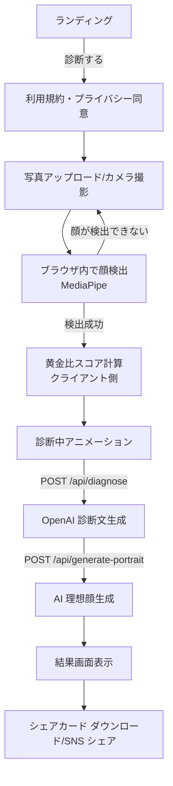

# TIAM Beauty AI 診断 Web アプリ 要件定義書

| 項目         | 内容                                |
| ------------ | ----------------------------------- |
| プロダクト名 | TIAM Beauty AI 診断（仮）           |
| バージョン   | 0.2（MVP ＋クリニック前提の追記）   |
| 作成日       | 2026-05-10                          |
| 最終更新     | 2026-05-13                          |
| 作成者       | TIAM 開発チーム                     |
| ステータス   | ドラフト                            |

---

## 1. プロジェクト概要

### 1.1 目的

ユーザーがアップロードした顔写真を AI が解析し、黄金比に基づく独自スコアと、美容アドバイスを含む診断レポートを自動生成する Web アプリを開発する。

「GPT が答えている」ように見せず、**TIAM 独自の AI 診断ブランド**として体験できる UI / UX を提供することを最重要要件とする。

### 1.2 ターゲットユーザー

- 美容意識の高い 20〜40 代女性（メインターゲット）
- TIAM ブランドに興味がある既存顧客・SNS フォロワー
- 美容医療・エステ・美容クリニックの導入検討顧客（B2B 二次展開を視野）

### 1.3 提供価値

- **手軽さ**: 写真 1 枚をアップロードするだけで、数十秒で診断レポートが届く
- **客観性**: 顔ランドマーク 478 点の数値解析による定量的スコア
- **エンタメ性**: シェアしたくなるビジュアル診断カード／AI 理想顔
- **ブランド体験**: TIAM 独自指標・トーン・ビジュアルで「TIAM の AI」として認識される

### 1.4 ゴール（MVP）

- 写真アップロード → 顔分析 → スコア → 診断文 → シェアカード を **全自動・1 フロー**で完結させる
- スマートフォン Web ブラウザで動作
- ローンチ後、SNS で共有された診断画像から流入が発生する状態を作る

### 1.5 ビジネス前提・提供形態（2026-05 合意）

本アプリケーションは **美容クリニックの来院顧客向け**の体験・説明補助を主目的とし、クリニックの集客・院内コミュニケーションに資するものとする。

- **利用者の範囲**: インターネット上の不特定多数へ無差別に公開する診断ツールではなく、**当該クリニックに来院した方を主対象**とする。URL（ドメイン）の周知は院内・来院動線に限定する方針とし、**来院者限定**を技術的にも裏付ける手段（簡易認証・スタッフ発行トークン・院内 QR 等）は Phase 2 以降で具体化する。
- **コンテンツ責任者の前提**: 依頼者は **医師免許を有する美容外科医**である前提とする。医療・施術に踏み込む説明の最終責任は院側の医学的判断・監修に帰属する。
- **上記と MVP スコープの関係**: 現行 MVP の機能一覧（F-01〜F-08）は維持しつつ、結果画面の情報設計・院側コンテンツ連携は **§4.9** の方針に沿って拡張する。

---

## 2. スコープ

### 2.1 MVP（Phase 1）スコープ

| #   | 機能                | 概要                                                            | 必須   |
| --- | ------------------- | --------------------------------------------------------------- | ------ |
| F-01 | 写真アップロード    | 端末から画像選択／ドラッグ＆ドロップ／カメラ撮影                 | 必須   |
| F-02 | 顔ランドマーク検出  | MediaPipe Face Landmarker（478 点）でクライアント側解析         | 必須   |
| F-03 | 黄金比スコアリング  | TIAM 6 大指標を計算・点数化                                      | 必須   |
| F-04 | AI 診断文生成       | OpenAI API（gpt-4o-mini）でスコアを基に診断文を生成              | 必須   |
| F-05 | 結果画面表示        | スコアレーダーチャート + 診断文 + 顔オーバーレイ画像             | 必須   |
| F-06 | シェアカード生成    | Satori で結果を 1 枚の PNG 画像に整形                            | 必須   |
| F-07 | AI 理想顔生成       | OpenAI gpt-image-1 で「あなたの黄金比顔」を生成                   | 必須   |
| F-08 | SNS シェア         | X / LINE / Instagram への共有導線                                | 必須   |

### 2.2 Phase 2（MVP 後）スコープ

| #    | 機能                       | 概要                                              |
| ---- | -------------------------- | ------------------------------------------------- |
| F-10 | Firebase Auth ログイン     | Google ログイン／メール認証                       |
| F-11 | 診断履歴保存               | Firestore に過去の診断結果を保存・一覧表示        |
| F-12 | レート制限／無料枠制御     | 1 日 1 回まで無料、IP / UID ベースで制限          |
| F-13 | 課金（Stripe）             | サブスクで複数回診断・高画質出力                  |
| F-14 | 多言語対応                 | 日本語 → 英語・中国語                             |
| F-15 | B2B モード                 | サロン・クリニック向け管理画面                    |

### 2.3 スコープ外（Phase 3 以降）

- 動画ベースの診断
- メイク提案 AR（試着）機能
- 商品レコメンド・EC 連携
- 医療相談的な機能（薬機法リスクのため）

---

## 3. ユーザー要件

### 3.1 ユーザーストーリー（MVP）

- **US-01**: 訪問者として、写真をアップロードしたら自動で診断結果を受け取りたい（操作は最小限）。
- **US-02**: 訪問者として、診断結果がきれいなビジュアルで表示されてほしい（SNS でシェアしたい）。
- **US-03**: 訪問者として、自分の「黄金比顔」がどんな顔なのか可視化されたものを見たい。
- **US-04**: 訪問者として、自分の写真が外部サービスに無断送信されないか不安なので、プライバシー方針が明示されていてほしい。

### 3.2 ユーザーフロー



---

## 4. 機能要件

### 4.1 F-01 写真アップロード

- 受付形式: JPEG / PNG / HEIC / WebP
- 最大サイズ: 10 MB
- スマホ撮影直後の HEIC は自動で JPEG 変換（クライアント側）
- アップロード前にプレビュー表示
- 顔が検出できない場合は再アップロードを促す
- **写真は外部サーバーに送信せず、ブラウザ内で解析する**（プライバシー訴求）
  - ただし F-07 AI 理想顔生成時のみ OpenAI に送信される旨を明示

### 4.2 F-02 顔ランドマーク検出

- ライブラリ: `@mediapipe/tasks-vision`（Face Landmarker）
- 出力: 478 点の (x, y, z) 正規化座標
- 顔が複数検出された場合: 最大顔のみを採用
- 顔が検出できない場合: エラーメッセージ「顔がはっきり写った写真をアップロードしてください」
- 実行: クライアント JavaScript（WASM）

### 4.3 F-03 黄金比スコアリング（TIAM 6 大指標）

| 指標名               | 計算内容                                                   | 理想値        |
| -------------------- | ---------------------------------------------------------- | ------------- |
| 縦三分割バランス     | 髪生え際〜眉 / 眉〜鼻下 / 鼻下〜顎先 の比率                | 1 : 1 : 1     |
| 横五分割バランス     | 顔幅 を 目幅 5 つ分で割った比率                            | 1.0           |
| 目間バランス         | 両目間距離 / 目幅                                          | 1.0           |
| 鼻口比率（黄金比）   | 鼻幅 / 口幅                                                | 1 : 1.618     |
| E ライン整合度       | 鼻先・上唇・下唇・顎先の直線関係                           | E ラインに沿う |
| 顔輪郭比率           | 顔幅 / 顔長                                                | 1 : 1.46      |

各指標を 0〜100 点に正規化し、加重平均で **TIAM バランス指数（総合スコア）** を算出する。

- 出力: `{ totalScore: number, scores: { [指標名]: number } }`
- 数値は小数第 1 位まで（例: 86.4）で表示し精密感を演出

### 4.4 F-04 AI 診断文生成

- API: `POST /api/diagnose`
- 入力: TIAM 6 大指標のスコア + 各指標の生値
- 出力 JSON Schema:

```json
{
  "overallComment": "string（総評 100〜150 字）",
  "strengths": ["string", "string", "string"],
  "improvements": ["string", "string"],
  "recommendedCare": ["string", "string", "string"],
  "tiamMessage": "string（TIAM からのメッセージ 50 字）"
}
```

- システムプロンプト要件:
  - 役割: 「TIAM ビューティーラボ顧問アナリスト」固定
  - 文体: 敬体、3 行ブロック、断定口調
  - **禁止語**: 「いかがでしょうか」「〜と言えるでしょう」「素晴らしい」など GPT 頻出フレーズ
  - 数値はクライアント計算済みの値のみ参照（ハルシネーション禁止）
  - 医療表現禁止: 「治療」「改善されます」→「美容バランスの傾向」へ言い換え
  - few-shot で TIAM らしい例文を 2〜3 件埋め込み
- モデル: `gpt-4o-mini`（コスト最適化）、JSON モード必須
- レスポンス時間目標: 5 秒以内

### 4.5 F-05 結果画面表示

- 表示要素:
  1. アップロード写真 + 顔オーバーレイ（三分割線・E ライン・ランドマーク）
  2. TIAM バランス指数（大きく表示、円形プログレス）
  3. 6 大指標レーダーチャート
  4. 診断文（総評 → 強み → 注意点 → 推奨ケア → TIAM メッセージ）
  5. AI 理想顔画像（生成完了後に表示）
  6. シェアカードダウンロード／SNS シェアボタン
- **拡張（§4.9）**: 依頼者モックに沿った **総合評価ブロックの強化・パーツ分析セクション・ドクター記述との併用表示・印刷** を後続フェーズで追加する。MVP 時点の上記 1〜6 は維持しつつ、レイアウトを段階的に寄せる。

### 4.6 F-06 シェアカード生成

- API: `GET /api/share-card?id=xxx`
- 技術: Satori + `@vercel/og`
- 出力: 1080 × 1920（縦長 9:16）の PNG 画像
- レイアウト:
  - 上部: TIAM ロゴ + "TIAM Beauty AI Diagnosis"
  - 中央: 顔写真サムネイル + バランス指数大数字
  - 中下: 6 大指標バー
  - 下部: 総評 1 行 + URL / QR

### 4.7 F-07 AI 理想顔生成

- API: `POST /api/generate-portrait`
- 入力: 元写真（base64）+ スコア + 性別推定
- 処理: OpenAI `gpt-image-1` で「黄金比に最適化された理想顔バージョン」を生成
- プロンプト: 元の人物のアイデンティティを維持しつつ、各指標が理想値に近くなるよう微調整
- 出力: 1024 × 1024 PNG
- レスポンス時間目標: 30 秒以内（非同期表示、スケルトン UI）

### 4.8 F-08 SNS シェア

- X (Twitter): Web Intent でシェアカード画像 + URL
- LINE: LINE Social Plugin
- Instagram: 画像ダウンロード → ストーリーズ手動投稿の動線
- ハッシュタグ自動付与: `#TIAMビューティー診断` `#TIAMAI`

### 4.9 診断結果画面の拡張方針（モック準拠・ドクター記述コンテンツ）

依頼者より共有された**診断結果画面のモック**を UI・情報設計の基準とする。理想の情報階層は次のイメージに沿う（文言・ブロック名は実装時にモックに合わせて調整可）。

1. **総合評価**: TIAM バランス指数（数値）に加え、短い要約・各指標の可視化（バー等）を含むヒーローブロック
2. **パーツ分析**: 目・鼻・口元・輪郭・左右対称性など、**パーツ単位**の分析カードまたはセクションを配置する
3. **総評（文章の総括）**: AI による総評・強み・注意点等と、院側のメッセージを読みやすく配置する（上記 1 と役割が重なる場合は、上＝数値中心／下＝読み物中心などに役割分担する）

#### 4.9.1 AI 診断と「施術」表現の分担

- **OpenAI による診断文（F-04）**は、引き続き **美容バランスの傾向・参考コメント**に限定し、**具体的な施術名・医療行為の推奨を AI が自動生成しない**方針とする（誤認・薬機法・景表法リスクの抑制）。
- **施術・治療方針に触れる説明**は、**医師が裏側（管理画面・CMS・院が管理するマスタデータ等）で記述・更新した公式文**として提供する。アプリは当該データを **AI 出力と明確に区別したうえで併用表示**する（例: ラベル・脚注で「AI による参考」「当院医師による説明」等を固定表示）。

#### 4.9.2 ドクター記述データの構造（パーツ細分化）

- ドクターが編集するテキストは、依頼者要望により **目・鼻・口・輪郭・左右対称性** 等の**パーツ（または院が定義するカテゴリ）**に細分化し、**カテゴリごとに独立した入力・保存**ができるデータモデルを想定する（初期は JSON／Firestore／Headless CMS 等、実装は別途設計）。
- 各パーツには、**見出し・本文（箇条書き可）・必要に応じた院独自の注意書き**を紐付けられること。

#### 4.9.3 併用表示と印刷

- 同一の結果画面（または印刷用ビュー）上で、**数値スコア＋AI 診断レポート＋ドクター記述コンテンツ**を一連のレポートとして閲覧できること。
- **印刷**については、院内説明・持ち帰り用として、ブラウザ標準の印刷、または **PDF 出力**等でレポート一式が再現しやすいレイアウトを理想要件とする（`@media print` 専用スタイルや印刷プレビューは実装タスクで定義）。

#### 4.9.4 法務・コンプライアンス（再掲）

- 医師作成の文面であっても、**景表法・薬機法等の対象になり得る**表現がある。最終公開文言は **TIAM／弁護士等のレビュー**を前提とする。
- AI 出力と院方文面の**視覚的分離**は、利用者の誤解防止のため必須とする。

---

## 5. 非機能要件

### 5.1 性能

| 項目                     | 目標値                               |
| ------------------------ | ------------------------------------ |
| ランディング初期表示     | LCP 2.5 秒以内                       |
| 顔検出処理               | 写真選択後 3 秒以内（端末性能依存）  |
| 診断文生成               | 5 秒以内                             |
| AI 理想顔生成            | 30 秒以内                            |
| 同時アクセス             | MVP は 100 セッション同時を目標       |

### 5.2 セキュリティ・プライバシー

- HTTPS 必須
- アップロード写真は **MVP では永続保存しない**（ブラウザ内処理のみ）
- AI 理想顔生成時、OpenAI への画像送信を明示同意（チェックボックス）
- OpenAI API キーは **必ずサーバー側 env に保管**（クライアント露出禁止）
- 利用規約・プライバシーポリシーを公開
- 写真の OpenAI 送信は明示同意ありで OpenAI のデータ利用ポリシーに従う旨記載

### 5.3 法令・コンプライアンス

- **薬機法**: 「治る」「治療」「医療効果」表現禁止
- **景表法**: 「最も美しい」「No.1」など根拠なき優良誤認表現禁止
- **個人情報保護法**: 顔写真 = 個人識別情報として扱い、利用目的を明示
- **特商法**: 課金 Phase で必要事項記載

### 5.4 対応ブラウザ

- iOS Safari 最新 2 バージョン
- Android Chrome 最新 2 バージョン
- PC: Chrome / Safari / Edge 最新版

### 5.5 アクセシビリティ

- WCAG 2.1 Level AA 準拠を努力目標
- 重要要素はキーボード操作可
- カラーコントラスト比 4.5:1 以上

### 5.6 SEO / OGP

- 各ページに動的 OGP 画像（診断結果ページはシェアカードを OGP 画像に流用）
- title / description / 構造化データ

---

## 6. 技術要件

### 6.1 技術スタック

| レイヤー        | 技術                                                            |
| --------------- | --------------------------------------------------------------- |
| フロントエンド  | Next.js 14（App Router）+ TypeScript                             |
| スタイル        | Tailwind CSS + shadcn/ui                                         |
| 顔解析          | `@mediapipe/tasks-vision`（Face Landmarker、WASM）              |
| AI（テキスト）  | OpenAI API `gpt-4o-mini`（JSON モード）                          |
| AI（画像）      | OpenAI API `gpt-image-1`                                         |
| 画像生成        | `satori` + `@vercel/og`                                          |
| インフラ        | Firebase Hosting / App Hosting                                   |
| DB（Phase 2）   | Cloud Firestore                                                  |
| ストレージ      | Cloud Storage for Firebase（Phase 2）                            |
| 認証（Phase 2）| Firebase Authentication                                          |
| 監視            | Firebase Crashlytics / Analytics                                 |

### 6.2 ディレクトリ構成（予定）

```
app/
  page.tsx                       ランディング
  diagnose/page.tsx              撮影・解析画面
  result/[id]/page.tsx           結果画面
  api/
    diagnose/route.ts            OpenAI 診断文 API
    generate-portrait/route.ts   gpt-image-1 理想顔生成 API
    share-card/route.tsx         Satori シェアカード PNG
components/
  PhotoUploader.tsx
  FaceLandmarkOverlay.tsx
  ScoreRadar.tsx
  ResultCard.tsx
lib/
  faceAnalysis/
    landmarker.ts
    goldenRatio.ts
    scoring.ts
  prompt/
    diagnosisPrompt.ts
public/
  models/                        MediaPipe モデルファイル
```

### 6.3 環境変数

| キー              | 用途                              | 公開 |
| ----------------- | --------------------------------- | ---- |
| `OPENAI_API_KEY`  | OpenAI 認証                       | ×    |
| `OPENAI_ORG_ID`   | OpenAI Organization               | ×    |
| `NEXT_PUBLIC_APP_URL` | アプリの公開 URL              | ○    |
| `FIREBASE_*`      | Phase 2 で必要                    | 一部 |

---

## 7. デザイン要件

### 7.1 ブランドガイドライン

- カラーパレット:
  - 主色: ブラック `#0B0B0B`
  - 強調色: シャンパンゴールド `#C9A96E`
  - 背景: ホワイト `#FAFAFA`
  - アクセント: ローズゴールド `#D9A6A6`
- フォント:
  - 和文: Noto Serif JP（見出し）/ Noto Sans JP（本文）
  - 欧文: Cormorant Garamond（見出し）/ Inter（本文）
- トーン: 高級感・サロンライク・静謐

### 7.2 演出

- 解析中アニメ: 顔の上をスキャンするゴールドのライン
- スコア表示: カウントアップアニメーション
- 結果画面: フェードイン + パーティクル

---

## 8. 運用要件（MVP）

- **ホスティング**: Firebase Hosting（静的 + 一部 Functions）または App Hosting
- **デプロイ**: GitHub → Firebase 自動デプロイ
- **コスト管理**: OpenAI 月額上限を $50 に設定し、超過時はアラート
- **監視**: Firebase Analytics / Crashlytics で CV 計測

---

## 9. リスクと対策

| リスク                           | 影響度 | 対策                                                 |
| -------------------------------- | ------ | ---------------------------------------------------- |
| OpenAI API のコスト暴騰          | 高     | レート制限、Phase 2 で認証必須化                      |
| 顔検出失敗による離脱             | 中     | 検出失敗時のガイド画像、リトライ動線                  |
| 「GPT 感」が出てしまう           | 中     | プロンプトの厳格化、出力 QA、文体禁止語フィルタ        |
| 薬機法・景表法違反               | 高     | 表現ルール作成、リーガルチェック、禁止語フィルタ      |
| 顔写真の流出懸念                 | 高     | クライアント解析を前面訴求、利用規約明示              |
| AI 理想顔の本人性低下によるクレーム | 中     | 「あくまで参考イメージ」と明示、生成失敗時はスキップ可 |

---

## 10. マイルストーン（MVP）

| 週   | マイルストーン                                            |
| ---- | --------------------------------------------------------- |
| W1   | プロジェクト初期化、UI スケルトン、写真アップロード        |
| W2   | MediaPipe 統合、黄金比計算、オーバーレイ                   |
| W3   | OpenAI 診断 API、結果画面、シェアカード                    |
| W4   | AI 理想顔生成、SNS 連携、Firebase デプロイ、QA             |
| W5   | リーガルチェック、コピー磨き込み、ベータ公開              |

---

## 11. 受け入れ基準（MVP リリース）

- [ ] 写真をアップロードしてから 60 秒以内に全結果が表示される（90% 以上のケース）
- [ ] 顔検出が正常に動作する写真で総合スコアが計算され、矛盾なく表示される
- [ ] 診断文に GPT 頻出フレーズ（禁止語リスト）が含まれない
- [ ] シェアカードが SNS に投稿でき、レイアウト崩れがない
- [ ] AI 理想顔が生成され、本人写真と並べて表示される
- [ ] 利用規約・プライバシーポリシーへの同意なしには診断が始まらない
- [ ] iOS Safari / Android Chrome で全機能が動作する
- [ ] OpenAI API キーがクライアントバンドルに含まれていない

---

## 12. 用語集

| 用語                  | 意味                                                          |
| --------------------- | ------------------------------------------------------------- |
| TIAM バランス指数     | 6 大指標の加重平均で算出する独自総合スコア（0〜100）          |
| 6 大指標              | 縦三分割／横五分割／目間／鼻口比／E ライン／顔輪郭比          |
| シェアカード          | 診断結果を 1 枚にまとめた縦長 PNG（SNS 用）                   |
| AI 理想顔             | 黄金比に最適化した参考イメージ（本人写真を基に生成）          |
| MediaPipe             | Google 製の顔ランドマーク検出ライブラリ                       |

---

## 13. 改訂履歴

| 日付       | バージョン | 変更内容               | 担当 |
| ---------- | ---------- | ---------------------- | ---- |
| 2026-05-10 | 0.1        | 初版作成（MVP 要件定義） | -    |
| 2026-05-13 | 0.2        | §1.5 ビジネス前提（来院者限定・医師前提）、§4.9 結果画面拡張（モック準拠・ドクター記述・パーツ細分化・印刷・法務）、§4.5 拡張への参照を追記 | -    |
